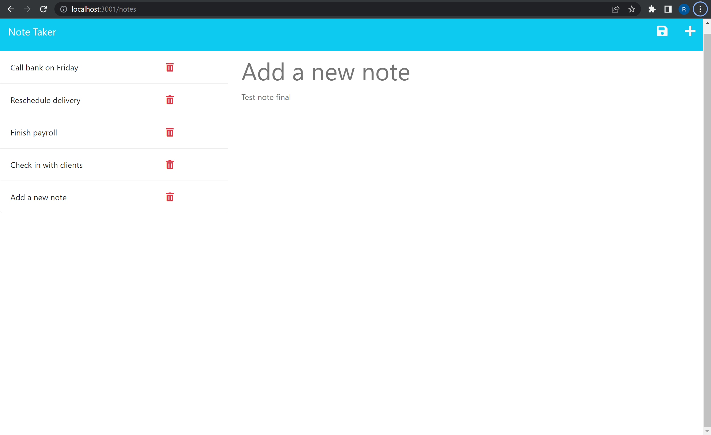

# Efficient-Notetaking

## Table of contents
​
- [Overview](#overview)
 - [The challenge](#the-challenge)
 - [Screenshot](#screenshot)
 - [Links](#links)
- [My process](#my-process)
 - [Built with](#built-with)
 - [What I learned](#what-i-learned)
 - [Continued development](#continued-development)
 - [Useful resources](#useful-resources)
- [Author](#author)
- [Acknowledgments](#acknowledgments)

## Overview
​
### The challenge
​
Users should be able to:
​
- Use node powered by Javascript and express.js
- Use Insomnia and get/post pathways
- connect and deploy with Heroku

### Screenshot
​

​
### Links
​
- Github URL: [efficient-notetaking](https://github.com/appleschaussaa/efficient-notetaking)
- Live Site URL: [Add live site URL here](https://your-live-site-url.com)
​
## My process
​
### Built with
​
- HTML/CSS
- Javascript
- Node and Express.js
- Insomnia
​
### What I learned
​
Upon revisiting this project I realized that I went into this initially not fully understanding how to go about implimenting express. It looked like most of my code was based off standard node and OOP we had used the previous two weeks. So I went back and added some of the techniques we had learned in week 11 such as creating api route files and adding helpers/middleware
​
### Continued development
​
It would be nice to improve upon this design and add an edit function once the note is made
​
### Useful resources
​
- [Useful resource 1](https://developer.mozilla.org/en-US/docs/Learn/Server-side/Express_Nodejs/Introduction) - was a nice reminder of oprating express
- [Useful resource 2](https://expressjs.com/en/api.html) - was planning to utilize this more
​
## Author
Robert Schauss

- GitHub - [appleschaussaa](https://github.com/appleschaussaa)

## Acknowledgments

The comments from my first submission were a nice reminder to check out the activities from module 11 and really implementing what we learned. The TAs did a nice job on how to copy over the files so they were not in a development folder and still keeping it connected to the github repo.
